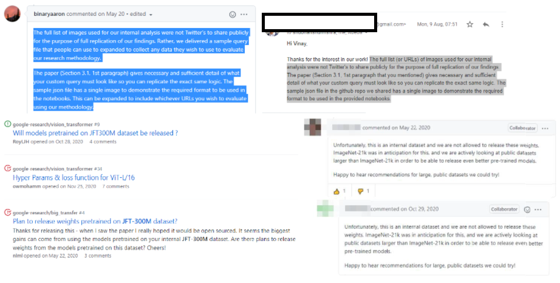
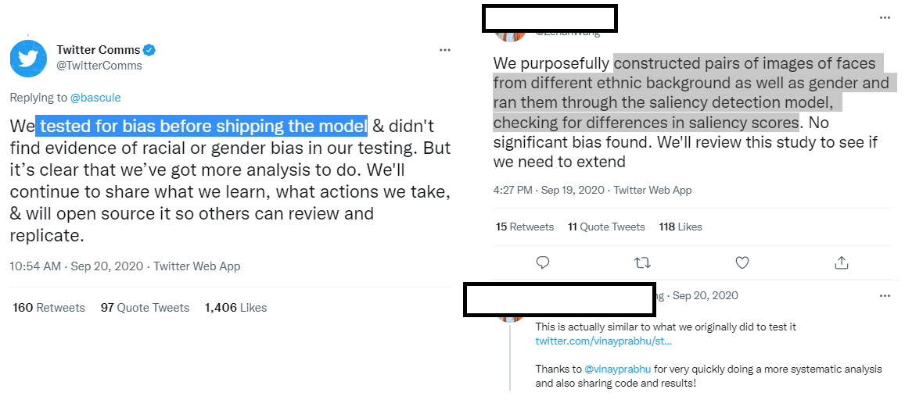

---
title: Twitter audit academic critique
layout: template
filename: acad_critique
--- 

# **Critique on “Image Cropping on Twitter: Fairness Metrics, their Limitations, and the Importance of Representation, Design, and Agency”**

Automated image cropping – although it takes place behind closed doors – has become a common practice on major platforms including Google, Apple, Adobe, and Facebook. In recent times, Twitter’s (erstwhile deployed) saliency cropping algorithm has received some intense [media scrutiny](https://www.theguardian.com/technology/2020/sep/21/twitter-apologises-for-racist-image-cropping-algorithm), followed by self-audits 👏 published here: [[Code](https://github.com/twitter-research/image-crop-analysis) Paper ([Version-1](https://arxiv.org/pdf/2105.08667v1.pdf),[Version-2](https://arxiv.org/pdf/2105.08667.pdf))].  \
Their [Github repo](https://github.com/twitter-research/image-crop-analysis) is replete with CLI access to their model and contains extremely well documented colab notebooks that enable not just reproducibility of the results in their paper but also a lot of imaginative downstream experimentation and scrutiny👏. 

What follows is therefore,**_ an academic critique_** and open questions that focuses on 5 specific points whilst acknowledging the pioneering nature of the work being critiqued and the efforts invested in creating the github repo with high quality documentation. 

**Table of contents:**

[TOC]

# 1-‘Emotion’ in ‘Emotion classification’, ‘Saliency’ in ‘Saliency cropping’ = Same energy  {#1-‘emotion’-in-‘emotion-classification’-‘saliency’-in-‘saliency-cropping’-=-same-energy}

Computer vision as a field has nearly perfected the art of reductionist caricaturing of rich, dynamic, cultural, historical and complex physio-socio-neurological phenomena by means of its much vaunted _capture-training-data-train-big-neural-network_ template. This has resulted in a grand hall of AI snake-oils populated by glorious hits such as  ‘Emotion classification’, ‘Facial attractiveness scoring’ and ‘Political/Sexual orientation estimation’. Emotion, attractiveness, and political/sexual orientation are complex phenomena that are a product of subjective judgement, historical and cultural norms, depend on context and background – such phenomena are contingent and dynamic and never something that can be read off of faces. The idea of reducing complex phenomena to physical features has long been found to have no scientific groundings and debunked as pseudoscience. To us, Saliency estimation, in its current form, is squarely knocking on the doors of this grand hall. To rephrase this, **Twitter’s problem was not just that its ‘AI’ was ‘biased’, the problem was that the ‘AI’ has all the telltale signs of a snakeoil.**

A cursory glance at the visual saliency literature ([Here](http://www.scholarpedia.org/article/Visual_salience)’s a TL-DR-esque starting point) reveals a rich landscape of ideas spanning phenomena such as Attentional boost, Attention bounce, Top-Down saliency, Bottom up saliency, Boomerang patterns etc all pointing towards the emergence of a complicated, subjective and more importantly **TEMPORALLY VARYING** response trapped in the antics of our saccades and microsaccades.

>>>>>  gd2md-html alert: inline image link here (to images/image1.png). Store image on your image server and adjust path/filename/extension if necessary.  (<a href="#">Back to top</a>)(<a href="#gdcalert2">Next alert</a>) >>>>> 

After sifting through the relevant saliency literature, the very idea of deploying a so-called ‘saliency estimation neural network’ that spits out a **STATIC **saliency heatmap in response to an input image appears rather far-fetched and problematic.  We note that a lot of the controversy surrounding the 3x1 grid images involving two faces has direct mapping to this careless effacing of the temporal variation facet that the computer vision community is now waking up to  (See Section _ **4.2. What is salient when?**_ from a recent paper titled _‘[How much time do you have? Modeling multi-duration saliency](https://openaccess.thecvf.com/content_CVPR_2020/papers/Fosco_How_Much_Time_Do_You_Have_Modeling_Multi-Duration_Saliency_CVPR_2020_paper.pdf)_’)

To be more specific, it is unclear as to what was that specific temporal exposure point (0.5s, 3s, 5s?) that Twitter’s saliency model’s training data was captured at and why? 

In the collage below, we see a collection of images pertaining to rocket launches and their ‘saliency cropped’ versions that highlights the downstream effect of this temporality effacing.  \

>>>>>  gd2md-html alert: inline image link here (to images/image2.png). Store image on your image server and adjust path/filename/extension if necessary.  (<a href="#">Back to top</a>)(<a href="#gdcalert3">Next alert</a>) >>>>> 

## Fuzzy definitions and discordant expectations

Another red-flag that we have seen with AI snake-oils  is this uncanny fuzziness and hand-waviness in the very definition of the phenomenon a given tool  proclaims to be measuring. For example, nowhere in Google’s emotion classification API documentation does one encounter a precise well knit definition of ‘emotion’.

>>>>>  gd2md-html alert: inline image link here (to images/image3.png). Store image on your image server and adjust path/filename/extension if necessary.  (<a href="#">Back to top</a>)(<a href="#gdcalert4">Next alert</a>) >>>>> 

Similarly, with regards to saliency cropping, we observed a spectacularly discordant folklore surrounding saliency. In our paper, “If saliency cropping is the answer, what is the question?”, we address this in Section 2.1, and state that:

“_Cataloguing the proposed definitions that researchers present in their saliency estimation work, it quickly becomes apparent that the concept is nebulous and fuzzy with no general consensus on how it is understood or used. Depending on the specific publication, saliency could mean subjective perceptual quality [15], visual contrast [19], proxy for important regions in an image [4], interestingness [36] alongside terms such as visual representativeness and foreground recognizability [14] and lastly intentionality [27]. The lack of coherent and somewhat commonly agreed understanding of the term has previously been pointed out. For example, Vaquero et al. [49] have pointed out that: there is no clear definition or measure to date as to the quality of I’ (a re-targeted image) being a good representative of I (the original image). More recently, in [27], while describing the task flow of the constituent ImportAnnots interface, Newman et al. state that "Participants are presented with a series of images one at a time and are asked to annotate the most important regions" adding that "There are no definitions of what should be considered important". Not only do we find inconsistent understanding of what saliency means, but also the concept is tied to woolly notions such as "important regions in an image" and "interestingness", concepts that are subjective, vague and context dependent_.”

In order to further highlight this mutually contradictory nature of aspects such as ‘interestingness’ and ‘typicality’, we present these images from the ‘flygate’ scandal that went viral during the 2020 US Vice-presidential debate that entailed a fly lingering on a participant’s head during the televised debate. The saliency model as shown in the image on the right emphasizes on the Eye-Nose-Mouth facial landmarks in tune with its ’training data expectations’, thus centering the typicality narrative. This coincides with little or no saliency associated with the anomalous fly on the head which was in fact the center-of-attention, hence quite literally **_the most salient region_** of the image.

>>>>>  gd2md-html alert: inline image link here (to images/image4.png). Store image on your image server and adjust path/filename/extension if necessary.  (<a href="#">Back to top</a>)(<a href="#gdcalert5">Next alert</a>) >>>>> 

While parsing through Twitter’s paper(s), we observed that there was NOT a single instance where the authors clearly defined what _saliency_ meant to Twitter and if this saliency cropping framework was indeed the solution, what was the need? Instead we encounter (in Page 1 and 2), a cacophonous mix of definitions where saliency quickly switches from meaning “the most interesting part” to “aesthetics” to “identify important content in the image” to “desirable thumbnails to users compared to shrinking the whole image to fit the viewport” and back to “Saliency scores are meant to capture the “importance” of each region of the image.”

(At this juncture, we duly note that we aren’t claiming that there is some pristine sanctimonious science that is being co-opted by computer vision at large. In that vein, we acknowledge that the ‘science’ surrounding complex phenomena such as attention and its mappings to brain physiology is replete with controversies as beautifully captured in Jordana Cepelewicz’s recent brilliant piece of science journalism found here:  https://www.quantamagazine.org/mental-phenomena-dont-map-into-the-brain-as-expected-20210824/ )

# 
    2-Audit Dataset - Choice, Sharing and _Templateism_ {#2-audit-dataset-choice-sharing-and-templateism}

# 

>>>>>  gd2md-html alert: inline image link here (to images/image5.png). Store image on your image server and adjust path/filename/extension if necessary.  (<a href="#">Back to top</a>)(<a href="#gdcalert6">Next alert</a>) >>>>> 

    Taking a deeper dive into Twitter’s self-audit left us with a number of unanswered puzzles, one that deserves some attention is their arbitrary race classification, which lacks rigour at the least and is callous, at worst. While one may downplay the concerns surrounding the offensive ethnicity-to-race [mapping](https://github.com/twitter-research/image-crop-analysis/blob/main/notebooks/Demographic%20Bias%20Analysis.ipynb) they used to define the racial “ground truths” while auditing their model as a marriage of convenience based on dataset availability, we were left rather concerned about how this dataset was never shared to the public and the culture of corporate templateism was used to deny requests for access.

    We previously encountered this exact phenomenon with the mysterious but highly influential JFT dataset. We posit that Google has developed this standard templated reply that reads “_Unfortunately, this is an internal dataset and we are not allowed to release these weights. ImageNet-21k was in anticipation for this, and we are actively looking at public datasets larger than ImageNet-21k in order to be able to release even better pre-trained models. Happy to hear recommendations for large, public datasets we could try!_”. This templated reply has been copy-pasted verbatim in response to every single query on Github or elsewhere when the ML community has requested access.

    Much to our dismay, with regards to Twitter’s ethnicity-race dataset, the standard templated reply **_copy-pasted verbatim_** on Github issues as well as email replies seem to be: “_The full list (or URLs) of images used for our internal analysis were not Twitter's to share publicly for the purpose of full replication of our findings. The paper (Section 3.1, 1st paragraph that you mentioned) gives necessary and sufficient detail of what your custom query must look like so you can replicate the exact same logic. The sample json file in the github repo we shared has a single image to demonstrate the required format to be used in the provided notebooks_.”. Despite some of their laudable self-audits and open-sourcing aspirations, Twitter’s refusal to share the ethnicity-race dataset goes against what they preach in public. 

    

>>>>>  gd2md-html alert: inline image link here (to images/image6.png). Store image on your image server and adjust path/filename/extension if necessary.  (<a href="#">Back to top</a>)(<a href="#gdcalert7">Next alert</a>) >>>>> 

# 3-The curious case of the internal third-party dataset that was never revealed {#3-the-curious-case-of-the-internal-third-party-dataset-that-was-never-revealed}

The audit paper (On page-7) claims that “ The model is trained on three publicly available external datasets: Borji and Itti [11], Jiang et al. [46], Judd et al. [47]”. However, upon sifting through the **[Pruning and optimizations part](https://blog.twitter.com/engineering/en_us/topics/infrastructure/2018/Smart-Auto-Cropping-of-Images), **we encounter this ‘ **third-party saliency data**’ that was used to train the smaller faster network that was deployed.

>>>>>  gd2md-html alert: inline image link here (to images/image7.png). Store image on your image server and adjust path/filename/extension if necessary.  (<a href="#">Back to top</a>)(<a href="#gdcalert8">Next alert</a>) >>>>> 

When we performed the _Male Gaze_ experiments in our paper, we noticed something strange. While Apple’s saliency estimation model too explicitly claims to pay heed to the text as well (and same was evidently true with some of the academic models trained on similar datasets we tried as well), none had such a strong fixation and vulnerability towards corporate logos and text in the background that caused the male-gaze-like crops. This goads us to believe that this could be on account of two sources:

1. The model pruning procedure used
2. The third-party data that was used during the pruning

Either way, this presents an incredible opportunity for Twitter to clarify to  the rest of the community as to what truly unravelled behind the scenes that resulted in this phenomenon.

# 4-The mysterious pre-deployment tests that were never mentioned {#4-the-mysterious-pre-deployment-tests-that-were-never-mentioned}

>>>>>  gd2md-html alert: inline image link here (to images/image8.png). Store image on your image server and adjust path/filename/extension if necessary.  (<a href="#">Back to top</a>)(<a href="#gdcalert9">Next alert</a>) >>>>> 

When Twitter’s paper was released on Arxiv, we were intrigued to see how the tests being presented in the paper were different from the ones they had internally conducted prior to deployment. Specifically, 

1. what datasets were used to sample faces from ‘different ethnic’ backgrounds 
2. what the saliency score results looked like 
3. What changed between 2019 and now (was it the architecture, more data driven fine-tuning, etc.)

Much to our dismay, these initial pre-deployment tests were not even mentioned anywhere in the dissemination. These are crucial questions, not only to saliency cropping research but also to the wider scientific community, we highly encourage Twitter to release open and transparent answers.  

# 
    5- Experimentation ratios and the Obama-McConnell picture

A recurring theme in all our experiments thus far has been spectacularly hopeless brittleness of the cropping framework. Even while experimenting with heavily standardized datasets such as CFD, the _survival ratios** dramatically flipped**_ when we changed the image dimensions or the resize ratios.  When we presented at the BeyondFairCV workshop, one of the recommendations we received to address this was that of observation-driven bottom-up experimental design. Thus, in all our experiments, all the images were precisely sized to be 583 × 3000 with 583 x 887 sized faces and a 583 × 1226 sized white blank image inserted in the middle keeping in line with the now iconic [Obama-McConnell image](https://twitter.com/bascule/status/1307440596668182528?s=20) tweet. In our experiments, we verify that Twitter’s model chooses McConnell’s face over Obama’s. In light of this, we found Fig.1 in the Twitter paper (see below) in poor taste where the authors chose to rather search and download images pertaining to these public personalities from wikidata to demonstrate how Obama’s face might have scored higher saliency in lieu of the actual viral image that triggered the audit in the first place.

>>>>>  gd2md-html alert: inline image link here (to images/image9.png). Store image on your image server and adjust path/filename/extension if necessary.  (<a href="#">Back to top</a>)(<a href="#gdcalert10">Next alert</a>) >>>>> 

We also found it odd and disappointing that Twitter failed to  address the specific grievances of the actual users on Twitter who have self-curated a vast treasure trove of miscropped instances in spite of having the proverbial front-row seat towards this content. We saw a similar theme emerge with the male-gaze cropping experiment as well where Twitter had direct access to a rich crowd-sourced user annotated dataset curated in real time by its own users. 

>>>>>  gd2md-html alert: inline image link here (to images/image10.png). Store image on your image server and adjust path/filename/extension if necessary.  (<a href="#">Back to top</a>)(<a href="#gdcalert11">Next alert</a>) >>>>> 

Finally, Twitter’s self-audit work is laudable and we hope encourages other platforms to follow Twitter’s lead and perform a similar critical work. In the absence of such work we remain in the dark about other platforms regarding their cropping policy, models, data, procedures and justification for deploying such tools. Science is supposedly considered self-correcting but not without active critical scrutiny. We raise the critical points and puzzling questions surrounding Twitter’s self-audit work in the same spirit here: from a place of care to a better, improved, and more transparent research practice.  
