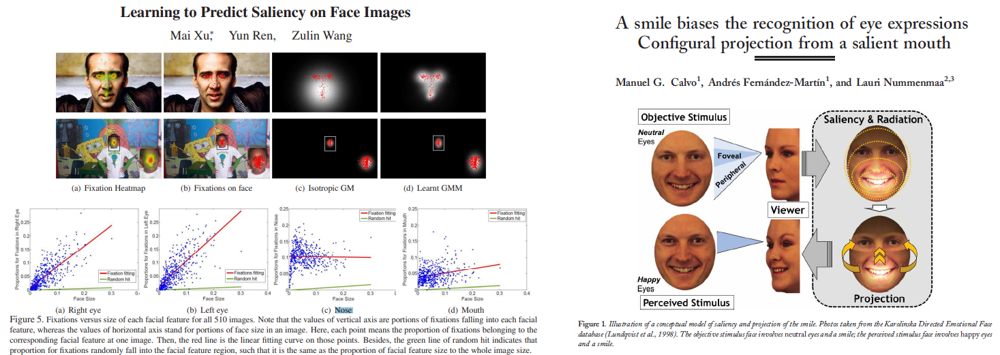

---
title: Future research directions
layout: template
filename: future_work
--- 

# Future research directions

If you are an academic researcher working on saliency estimation/cropping here are some questions we pondered about but did not have the bandwidth to execute on:

a) The fate of saliency cropping models initialized with a pre-trained models trained on:

  i) [Face-blurred version of the ImageNet dataset](https://github.com/princetonvisualai/imagenet-face-obfuscation).

  ii) [The PASS dataset](https://github.com/yukimasano/PASS/) (Has no human faces)

  iii) Multi-modal datasets (Ex: CLIP trained on WIT and [FaRL for Facial Representation Learning](https://github.com/microsoft/FaRL) model training on a subset of LAION-400M)

b) Repeating the experiments with other datasets from the [CFD group](https://www.chicagofaces.org/) such as CFD ver 3.0, CFD-MR, CFD-India.

c) Understanding **_WHY_** Twitter's model had this uniquely strong fixation towards corporate logos and background text

d) Understanding the effect of model compression on downstream biases. We have repeatedly seen in our professional work that compressed models, whilst maintaining high in-distribution validation accuracies, often tend to open up enhanced vulnerability to OOD (Out of distribution) inputs

e) Abstention class modeling with saliency cropping frameworks (Knowing when not to crop)

f) Model calibration: We have shared all the results pertaining to model confidence scores provided by Google's and Apple's APIs. Related to (e) above, it'd be worthwhile trying to understand what a 'calibrated confidence score' would look like.

# Post WACV summary
Adhering to the rich culture of jargon overloading prevalent within computer vision, it appears as if the term _saliency map_ has frustratingly come to mean two things from two seemingly disparate yet intersecting worlds:

- Saliency-1 that hails from the interpretable/explainable AI world that basically answers ‘What did the model see in the input (image) to arrive at this classification?’ (Think of SmoothGrad, Guided BackProp, GradCAM)
- Saliency-2 that hails from the eye movement research world that basically attends to the question: ‘Where would the human eye spatially fixate in this input image’ ?
Hence, this has led to saliency estimation models of two types that we refer to as type-1 and type-2 henceforth (mapping to Saliency-1 and Saliency-2 above).

Thus, while interacting with researchers who work on saliency estimation of both types, the following ideas / research questions came up.

1. Intersection over Union (IoU) analyses of the outputs of the Saliency-1 and Saliency-2 models for the same input image. 
(Basically, what’s the nature and volume of overlap between what the CNN ‘saw’ and what the “human” saliency-estimation model ‘saw’)

2. What would happen if we replaced the type-2 estimation models such as Deep-Gaze-2 in SIC pipelines with type-1 GradCAM-type model?

3. Volunteer generated fixation maps versus type-1 averaged saliency maps : 
_Generate a synthetic ground truth ‘saliency-map’ by combining the individual outputs of several saliency-2 models (SmoothGrad, Guided BackProp, GradCAM) with some Gaussian blur smoothing. Compare this with those emerging from fixation studies.  Perform, both the IoU analysis as well as temporality analysis (when does the IoU peak?)_

4. Fine grained classification as a theater of comparative analysis between saliency-1/saliency-2 model outputs.

Consider a binary classifier that classifies images into crocodiles and alligators. 
What should the 'ground truth' look like given that there's exists rigorous domain knowledge as to what exactly the difference in the class specific phenotypical expressions are?

5. Difference in fixation gazes between an expert trained eye and an untrained eye:
 Consider a trinary classifier with output classes being wasps, hornets and bees. How would the saliency maps extracted from a melittologist (or an apiologist) differ from a normal person and how do we train a classifier that is adherent to these 'correct' fixations.
 
6. Sharding the image and using image captioning on the sharded sub-images to generate explanations. (Madras crocodile bank dataset)

7. Fate of imagenet trained models trained with 1001 nodes where 1001th node is the ‘background’ node which is trained as follows:
Take all the images in the training set and blur out the salient part of the image that contains the class object. All that now remains (ideally) is the background in the image. Label these to be belonging to class 1001 (or background class) and train a new model. Compare this model with a baseline model for a given OOD image test set and see if the baseline model is more OOD-susceptible.

8. Saliency estimation via cosine score proxies: Given an (image, text description) pair, shard the image into sub-images. For each sub-image generate caption and compute cosine distance with the true textual description. That cosine distance will serve to be a proxy for saliency score for that sub-image or patch.
Replace random patches in papers such as FARL with saliency-1/saliency-2 patches to force the neural network to learn the fine-grained features better.
 

## An important note on the nexus between saliency cropping bias and granular objective face-metric evaluations.

When it comes to saliency scores associated with human faces, psychonomic datasets such as CFD have detailed measurements falling into 3 categories: Sxx - Self reported measures, Rxx - Measures from independent rater sample and Pxx - Physical attribute measures (with objective measurements of metrics such as fWHR2, NoseWidth, NoseLength etc). It is entirely possible that these face physical attribute measures might have a stronger predictive power explaining the observed biases than self-reported racial categorization. In fact, a quick literature survey reveals an entire body of work that specifically investigates this intersection between granular facial features and fixation/saliency patterns  

_But we however posit that such an undertaking has to be carried out with extreme care by a multidisciplinary team encompassing computer vision researchers, ethicists, specialist scholars from experimental psychology and psychonomics alike._
