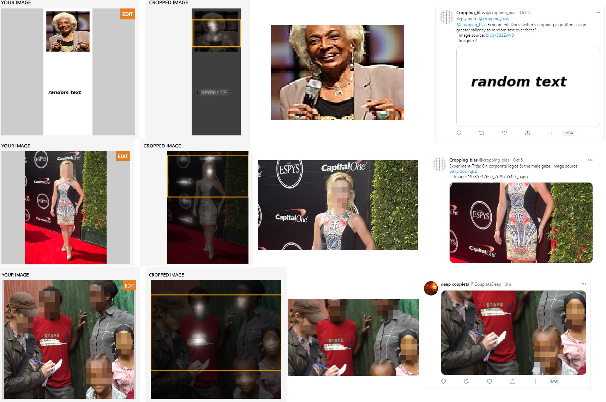

---
title: Gallery of Gaffes
layout: template
filename: gallery_gaffes
--- 

# Gallery of Gaffes

## What is the Obama-McConnell image had met with a different SIC pipeline?

## Err...Was Korner et al's model 'better'? Regression examples

## Male gaze via the 'centering' effect?

## Volte-face this fast?

## Is saliency 'anaomaly' or 'typicality'
Trapped between the Top-Down and Bottom-Up saliency worlds :'(

