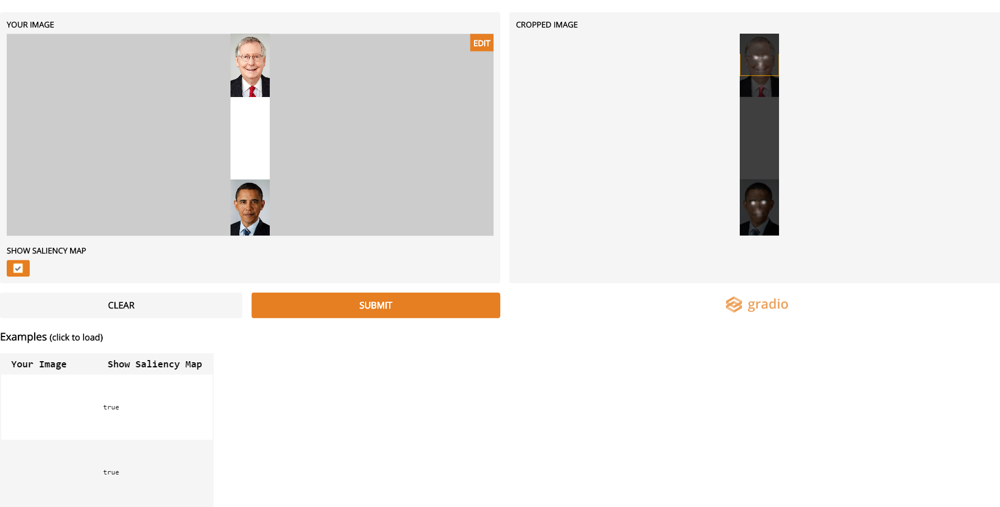
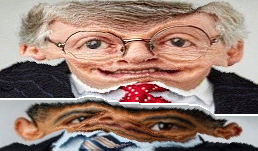
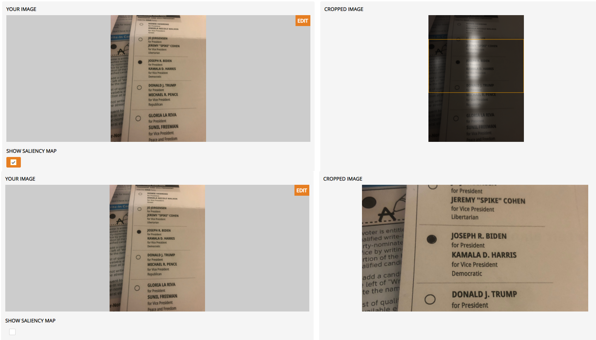

---
title: Gallery of Gaffes
layout: template
filename: gallery_gaffes
--- 

# Gallery of Gaffes

## What if the Obama-McConnell image had met with a different SIC pipeline?

1: Korner et al's model favored McConneln as well!

2: Adversarial vulnerability test-1. What if I _mildly_ pixelated their faces? 
Would it flip the fate of the cropped image?

3: What if [Seam Carving](https://www.aryan.app/seam-carving/) was implemented in lieu of SIC?

## Err...Was Korner et al's model 'better' at handling text and logos?

## Male gaze like artifacts can also be seen via via the 'centering' effect?

## Is saliency 'anaomaly' or 'typicality'
Trapped between the Top-Down and Bottom-Up saliency worlds :'(

## [Photobomb defusal expert](https://ieeexplore.ieee.org/document/8454255) eh?

## The volte-face ;)?

