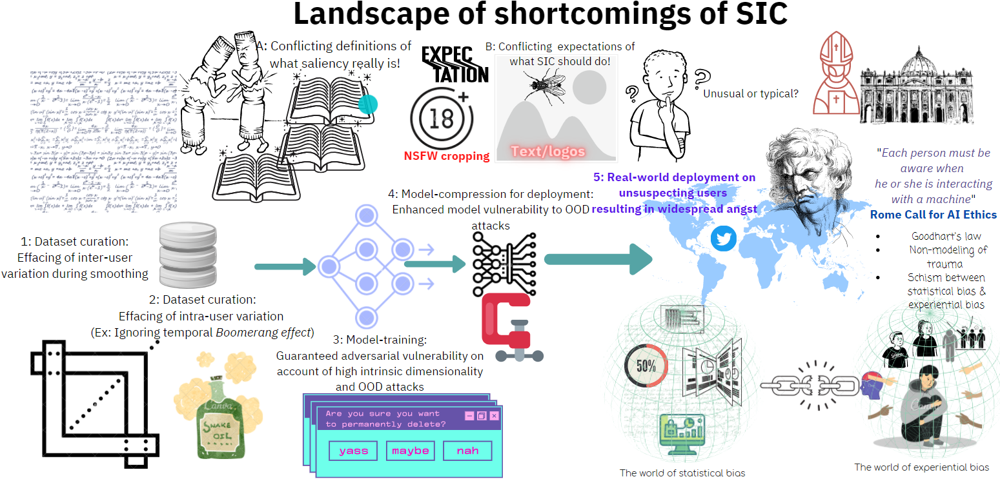

<button onclick="location.href='./sub_pages/paper_html/main.html'" type="button"> WACV-2022 Paper</button>
<button onclick="location.href='temp_del.md'" type="button">  Timeline of the project </button>
<button onclick="location.href='./sub_pages/timeline.html'" type="button"> Twitter-Critique </button>

# Auditing Saliency Image Cropping

## Table of contents
check22 
- [Timeline](###timeline)
- 

For the past year, we have been investigating this murky yet fascinating tech called Saliency cropping that passively touches all our lives silently influencing the ways in which we encounter digital images on the world wide web.

Sold under different monikers such as ‘AI assisted cropping’, ‘Smart cropping’ and  ‘Content aware cropping’, it has come to be extensively used by all the major digital content serving platforms such as Twitter, Facebook, Google, Microsoft, Apple etc that seek to deliver their image-laden content on a wide array of consumption devices of varying screen sizes, aspect ratios and viewing angles. 

While Twitter had to grapple with the downstream cropping biases experienced by its users in a very [public way](https://www.theguardian.com/technology/2020/sep/21/twitter-apologises-for-racist-image-cropping-algorithm) ultimately resulting in its removal, it continues to be deployed aggressively across the other platforms. 

We created this website to catalogue all our investigative efforts spanning 15 months, 3 continents, 2 papers, and, well, 2 COVID diagnoses :( .

If you are a researcher with relevant expertise who’d like to join hands, feel free to contact us!

<iframe width="560" height="315" src="https://www.youtube.com/embed/BSHG0bIcNL0" title="YouTube video player" frameborder="0" allow="accelerometer; autoplay; clipboard-write; encrypted-media; gyroscope; picture-in-picture" allowfullscreen></iframe>

### Presentation slides from WACV-2022
<iframe src="https://docs.google.com/presentation/d/e/2PACX-1vQwhwiHbwW6eCiCoRTYWJ9kBzYzxwd2TWCrA7AIbqWilA9-Phiz3DKn_mnHMI2B2VtJ1Fan4DawUAOx/embed?start=false&loop=false&delayms=60000" frameborder="0" width="480" height="299" allowfullscreen="true" mozallowfullscreen="true" webkitallowfullscreen="true"></iframe>

### Materials presented at the [CVPR-2021 workshop](https://sites.google.com/view/beyond-fairness-cv/accepted-papers?authuser=0)
- [Paper](https://github.com/vinayprabhu/Saliency_Image_Cropping/blob/main/paper/%5Bpaper%5DIf%20saliency%20cropping%20is%20the%20answer%2C%20what%20is%20the%20question_CVPR_2021.pdf)
- [Poster](https://github.com/vinayprabhu/Saliency_Image_Cropping/blob/main/paper/%5Bposter%5DIf%20saliency%20cropping%20is%20the%20answer%2C%20what%20is%20the%20question_CVPR_2021.pdf)
- [Reviews](https://github.com/vinayprabhu/Saliency_Image_Cropping/blob/main/paper/Reviews_BeyondFairCV_2021_SIC.pdf)

<iframe src="https://docs.google.com/presentation/d/e/2PACX-1vT3nr80ooMkBfvq0QgX6Z-eV_pYVtQzR78kcqxVfgxqnasFut32YoxK52OiqE7wkyOzpUw2pF4eElJc/embed?start=false&loop=false&delayms=60000" frameborder="0" width="480" height="299" allowfullscreen="true" mozallowfullscreen="true" webkitallowfullscreen="true"></iframe>

### Timeline
| Date 	| Event 	|
|:---:	|:---:	|
| September 19, 2020 	|  🔭Discovery on Twitter and first simple set of experiments 🔬 	|
| September 19, 2020 	|  ✍Created the @cropping_bias Twitter account to crowd-source the instances of offensive crops that informed our experiments 	|
| September 21, 2020 	|  ✍First blogpost titled ‘On the Twitter cropping controversy: Critique, clarifications & comments’  	|
| October 2, 2020 	| ✍ Second blogpost on Scrutinizing Saliency-Based Image Cropping 	|
| October 9, 2020 	| A 30 min discussion with 2 members of a ‘meta-team’ within Twitter 	|
| April 2, 2021 	| 😍 ✍ First workshop paper submission to the BeyondFairCV workshop (as Submission 21) 	|
| May 23, 2021 	| 😎 Acceptance notification (Original decision date was Apr 23, but got postponed on account of the pandemic)  	|
| June 21, 2021 	| ✍ Submission of the camera-ready version of the paper to the organizers of the workshop 	|
| June 25, 2021 	| 🙌 Paper presentation at the workshop via Discord 	|
| August 11, 2021 	| ✍ Second paper submitted @ WACV-2022 (Round-2) 	|
|  October 4, 2021 	| Acceptance notification at WACV-2022  🙌 	|
| January 6, 2022 	|  😎 🎊 Paper + Poster presentation at WACV-2022   	|
