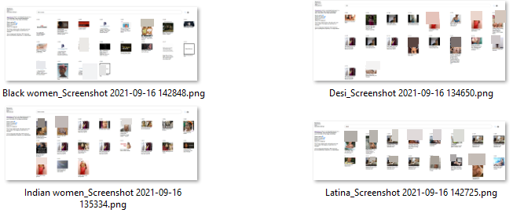
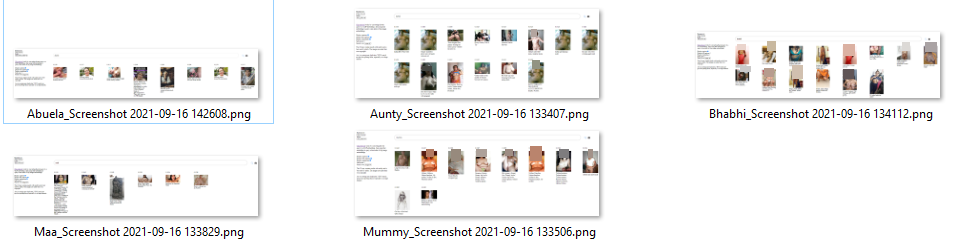
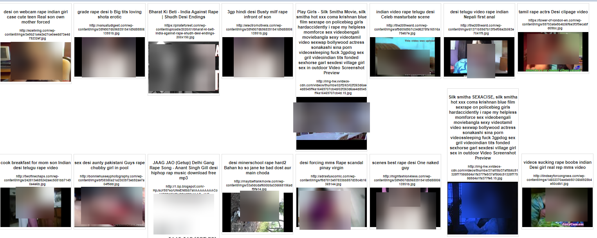

# Multimodal datasets, multimodal horrors

Authors: *Abeba Birhane, Emmanuel Kahembwe , Vinay Prabhu*

**Table of Contents:**

# The 'multimodality project' : A necessary pitstop towards 'solving intelligence' and 'AGI'

Simply put, the multi-modality narrative in Computer Vision has the following spiel: *Siloed attempts to create task-specific models for classification, segmentation, detection etc will only serve to create super-specialized brittle ANI (Artificial Narrow Intelligence) models. If we are to 'solve intelligence' and achieve robust AGI (Artificial General Intelligence), we ought to be curating cross-domain datasets and training cross-domain models geared towards learning the nexus between the 3 modalities of Vision, Text and Speech*.

In the specific context of the ***Vision-Text dyad***, the endeavor begins with curating large-scale datasets of tuples of the form: $D=\{(x_i,t_i,\mu_i)\}_{i=1}^N$ where $x_i$ is the ${i}^{th}$ image, $t_i$ is the textual description associated with the ${i}^{th}$ image, and $\mu_i$ is the ${i}^{th}$ image's meta-data. This vertical of  *multimodality pursuit* has been underway since 2010 with the arrival of the UIUC-PASCAL Sentence dataset. The year 2015 was in some ways the *annus mirabilis* that saw the emergence of four large scale initiatives: The Microsoft COCO: Common Objects in Context dataset (330,000 images with 5 independent human generated captions), the Yahoo Flickr Creative Commons 100 Million (YFCC100M) Dataset,  the Visual Question Answering (VQA dataset with 265016 images with at least 3 questions per image and 10 ground truth answers per question) and the Visual Genome (108,077 Images with 5.4 Million Region Descriptions and 1.7 Million Visual Question Answers) projects. These projects banked on a rough template of *carefully* crowd-sourced captioning of a pre-existent-image-dataset either by using platforms such as AMT or using photo-uploader captions from Flickr. 

## Then 2021 happened: CLIP, ALIGN and Wu Dao

The literal OGs of internet-sized-stealing-propelled large scale machine learning models, OpenAI and Google, trumpeted the release of 2 breakthrough models: CLIP (Contrastive Language-Image Pre-training) and ALIGN (A Large-scale ImaGe and Noisy-Text Embedding). These two endeavors broke ranks with the old recipe of handheld data curation and went after another recipe that would help scale their datasets into hundreds of millions or even billions: *loot-en-masse on the world-wide-web*. Armed with their web-sized scraping infrastructure, they merrily went after the billions of images on the internet paired with their 'noisy' [alt-text](https://www.w3schools.com/tags/att_img_alt.asp) descriptions. 

OpenAI's CLIP used an internally curated WIT (WebImageText) dataset consisting of 400 million (image, text) pairs collected form a variety of publicly available sources on the Internet. Their [model-card](https://github.com/openai/CLIP/blob/main/model-card.md) documentation states that: “*The model was trained on publicly **[available](https://www.merriam-webster.com/dictionary/steal)** image-caption data. This was done through a combination of crawling a handful of websites and using commonly-used pre-existing image datasets such as YFCC100M. A large portion of the data comes from our crawling of the internet*.” We get a little more insight into how the text captions were actually generated only via a [github-issue response](https://github.com/openai/CLIP/issues/118#issuecomment-871263743) by a co-author where we encounter: “*The dataset is a mixture of image-text pairs from various sources. The 'full text sequences' are usually title + description concatenated using whatever is available about the image, usually being a sentence or two and not the whole webpage.* “😒

Google's ALIGN went one step further and created a billion-sized dataset whilst pulling off an even sinister slight of hand in marketing the complete paucity of thoughtful curation as freeing the community from the clutches of high curation costs: "*This [costly](https://www.theverge.com/2021/7/27/22596592/google-q2-2021-record-revenue-profit-youtube-ad-cloud-search) curation process limits the size of datasets and hence hinders the scaling of trained models. In this paper, we leverage a noisy dataset of over one billion image alt-text pairs, obtained **without [expensive](https://www.reuters.com/technology/google-parent-alphabet-beats-sales-estimates-ad-spending-soars-2021-04-27/) filtering or post-processing steps** in the Conceptual Captions dataset*".🤬

( Note the choice of the wording in the above paragraph: 'available', 'noisy' ,'hinders', 'expensive')

The [engadget article](https://www.engadget.com/chinas-gigantic-multi-modal-ai-is-no-one-trick-pony-211414388.html) specifically mentioned the alt-text aspect while stating  "The model can not only write essays, poems and couplets in traditional Chinese, it can both generate ***alt text*** based off of a static image and generate nearly photorealistic images based on natural language descriptions. Wu Dao also showed off its ability to power virtual idols (with a little help from Microsoft-spinoff XiaoIce) and predict the 3D structures of proteins like AlphaFold".

## Then LAION-400M happened.

This week, the machine learning community woke up to the [news](https://twitter.com/arankomatsuzaki/status/1437113883529986048?s=20) of a certain large scale LAION-400M dataset being released. A group of '[community funded](https://gogetfunding.com/help-us-build-the-worlds-largest-open-billion-scale-image-text-dataset-perfect-for-training-dall-e-clip-other-multimodal-models/)' machine learning enthusiasts belonging to a DIY [non-profit organization](https://laion.ai/#about) had extracted 400 million (Now a billion+)  image-text-pairs from the Common Crawl web data dump (from random web pages crawled between 2014 and 2021) and filtered these with OpenAI‘s CLIP (by dropping those images whose text and image embeddings had a cosine similarity below 0.3). They also provided for a [CLIP-powered semantic search GUI](https://rom1504.github.io/clip-retrieval/). When one of us co-authors began to elicit responses to even benign queries such as *beautiful*, *small* and *Asian*, pornographic imagery inundated the search results space (See image below)


A collage of images demonstrating the sordid results obtained on the morning of September 12th

When we searched for terms such as 'Indian women', 'Black women' or 'Latina', the misogynistic porn-laden responses either remained or worsened!  Even typing in 'Desi' which is a word used to describe the people, cultures, and products of the Indian subcontinent and their diaspora, derived from Sanskrit देश (deśá), meaning "land, country") resulted in almost exclusively porn-related imagery being retrieved.



Similarly, the query results for words such as Mummy and Aunty/ auntie were mostly porn-related. Even cross-cultural queries such as Abuela (grandmother in Spanish), Maa (Mother in Hinglish) and [Bhabhi](https://en.wiktionary.org/wiki/Bhabhi) (A title used for an elder brother's wife in India and Pakistan) resulted in: You guessed right. Mostly porn-related images.



Some of the images also included explicit r*pe scenes and deep-fakes taken from the darkest corners of the porno-spheres on the internet. 

**What had just happened?! What had just happened?!** 

As soon as the word spread around on Reddit and Twitter, the curators quickly put in 'better filtering' mechanisms making it harder to access these images but the images are still there!  All in their neatly packaged 'numpy'fied 'parquet'ed 'CSV'ed glory.

Instead of opportunistically pouncing on the curators for their cavalier curation practices , we now present an inquisition into the chain of events and the prevalent false beliefs that culminated in the creation of this house of horrors.

# A whyness inquisition (Still working)

In this subsection, we will analyze the four functional components of the LAION-400M dataset: the cosmology of images on the WWW, the associated Alt-text data, OPENAI-CLIP and the culture; and understand how we find ourselves here.

## "Closed-AI has been a meme for years!"

The Darth Vaderesque caricature of OpenAI looms large in the ML/AI. There's a general belief that much akin to Anakin, OpenAI began with good intentions but later sold its soul and switched to the dark side whilst firmly entrenching itself in a closed source commercial API business model. For what it's worth, OpenAI on their part have been rather frank about this volte-face as is reflected in their API-[FAQ section](https://openai.com/blog/openai-api/) where they address questions like:

Why did OpenAI decide to release a commercial product?

Why did OpenAI choose to release an API instead of open-sourcing the models?


As literally stated in the README markdown file of their Github repo, the LAION 'TRULY OPEN AI' team-members (Notice the *OPEN AI* assertion) actually set out to rebuild OpenAI's 400million Image-Text dataset in order to produce open-source variants of CLIP and DALL-E and replicate what [EleutherAI](https://www.eleuther.ai/)  (A grassroots collective of researchers) did with WebText/GPT-3 (Read Pile/GPT-J-6B and Pile/GPT-Neo-1.3-2.7B).


Concerns: 
The creators of CLIP have been rather 'frank' about the CLIP's shortcomings, which is reflected in the tonality of the model card as well as certain sections in the main paper. Whilst peddling an entire bias-related sub-section in their paper (See 7.1. Bias), they coyly admit that images belonging to the 'Black' racial designation had an approximately 14% chance of being mislabeled as 

`[ ‘animal’, ‘gorilla’, ‘chimpanzee’, ‘orangutan’, ‘thief’, ‘criminal’ and ‘suspicious person’]` in their FairFace dataset experiment. 

Further, it has emerged through both [reddit folklore](https://www.reddit.com/r/MachineLearning/comments/m0ll9w/d_openais_clip_and_dalle_seem_to_be_trained_on/)  and OpenAI's visualization projects such as [Microscope](https://microscope-azure-edge.openai.com/models) that graphic NSFW / pornographic [samples](https://distill.pub/2021/multimodal-neurons/) were not exactly filtered out from the training dataset . A flagship example of this is the [Unit 1,543](https://microscope-azure-edge.openai.com/models/contrastive_4x/image_block_4_5_Add_6_0/1543) in `image_block_4_5_Add_6_0` of the CLIP-Resnet-50-4x model. 

 in image_block_4_5_Add_6_0. [Source](https://microscope-azure-edge.openai.com/models/contrastive_4x/image_block_4_5_Add_6_0/1543)](images_/Untitled%203.png)

Channel  [Unit 1,543](https://microscope-azure-edge.openai.com/models/contrastive_4x/image_block_4_5_Add_6_0/1543) in image_block_4_5_Add_6_0. [Source](https://microscope-azure-edge.openai.com/models/contrastive_4x/image_block_4_5_Add_6_0/1543)

The text that maximizes dot product with neuron include:

0.44 erotic for virgin types ⤵ welcome on
0.44 erotic pleasure virgin types ⤵ on
0.43 # 3 sexlife 1 stroke # htc
0.43 # 3 sexlife 1 stroke # htc
0.42 for - my - virgin ssive types ⤵ click here ▶️
0.41 # 3 sexps 1 stroke
0.41 # sexwork 1 stroke # htc
0.41 for xvirgin types ⤵ click here
0.41 # 3 sexes 1 stroke
0.41 # thesexarunbell
0.41 # sexarunbell
0.41 for my virgin types ⤵ click here
0.40 # sexcraftxvi is #
0.40 and for pleasure virgin silk ⤵
0.40 # sexwork 1 stroke # supersaturday
0.39 # sexcraftworship #
0.39 # sexcraftbell #
0.39 # eroticwroeby worship
0.39 # eroticwroeby worship
0.38 the # eroticexpo
0.38 the # eroticstaff
0.38 # eroticworship
0.38 sexcraftcon # challdropped light volu
0.37 pleasure virgin virgin silk nutrition services � totally
0.37 # sexcraftcon # challis #
0.35 sexwork thisist wed twin krihit
0.34 # nsfw genchatvinwrogt by
0.34 nsfw genari lmavinamerican wroiregt powered

## Why using CLIP based filtering can be dangerous!

As part the dataset curation process, the curators state that "*We have filtered all images and texts in the LAION-400M dataset with OpenAI‘s CLIP by calculating the cosine similarity between the text and image embeddings and dropping those with a similarity below 0.3*".

Besides the obvious data-incest issue of using CLIP as a filtering model in order to potentially generate CLIP-like models, this idea is ill advised on account of other serious issues some of which we explore in detail below:

a) The model card literally pleads you not to!

CLIP's [model card](https://github.com/openai/CLIP/blob/main/model-card.md) explicitly states that "*The primary intended users of these models are AI researchers. We primarily imagine the model will be used by researchers to better understand robustness, generalization, and other capabilities, biases, and constraints of computer vision models".* Further, with regard to 'Out-of-Scope' use cases, the model card makes it amply clear that : "*Any deployed use case of the model - whether commercial or not - is currently out of scope. Non-deployed use cases **such as image search in a constrained environment, are also not recommended unless there is thorough in-domain testing of the model with a specific, fixed class taxonomy**. This is because our safety assessment demonstrated a high need for task specific testing especially given the variability of CLIP’s performance with different class taxonomies. This makes untested and unconstrained deployment of the model in any use case currently potentially harmful".*

Further, the ad hoc assumption of 0.3 cosine-similarity threshold can be a source of trouble as well. In the example below, we demonstrate two examples. The first example below contains the famous Photograph of Eileen Collins ( an American astronaut who first piloted the space shuttle STS-63 in 1995) from the [scitkit-image library](https://scikit-image.org/docs/dev/api/skimage.data.html?highlight=bool). We now compute the CLIP cosine similarity on her image with regards to the following textual inputs:

`Text-input-1: "This is a portrait of an astronaut with the American flag"`

`Text-input-2: "This is a photograph of a smiling housewife in an orange jumpsuit with the American flag"`

The cosine similarities obtained as 0.28 and 0.31 respectively. Now imagine the scenario where the scraper module encountered 2 instances of this image, the first with the reasonable benign description in `Text-input-1` and the second with the misogynistic description of `Text-input-2`. Because of the gender biases built into CLIP, Similarly, in Example-2 below, we demonstrate similar issues with Barack Obama's Official portrait, 2012 where the text-input "This is the portrait of the first ever illegal president of the United States born in Kenya" has a >0.3 cosine similarity while the description "This is the portrait of a former president of the United States" has a similarity of <0.3 (0.28).


To those invoking the 'cherry-picked-examples' excuse, we'd like to invite them to not only experiment with the colab notebook [here](https://github.com/vinayprabhu/Crimes_of_Vision_Datasets/blob/master/CLIP_astro_obama.ipynb) and see not only how easy it is to produce such so termed "corner cases" but to also sift through the sk-image examples provided in OpenAI's own example notebook, the results of which are summarized in the image below ( Note the cases where palpably obvious images with reasonably accurate descriptions still yield a cosine similarity of less than 0.3)


```python
from textwrap import wrap
from PIL import Image
import requests
from io import BytesIO

device = "cuda" if torch.cuda.is_available() else "cpu"
def est_clip_sim(img,text_input):
	image = preprocess(img).unsqueeze(0).to(device)
	image_input = torch.tensor(image).cuda()
	text_tokens = clip.tokenize(text_input).cuda()
	with torch.no_grad():

		image_features = model.encode_image(image_input).float()
		text_features = model.encode_text(text_tokens).float()
	
	image_features /= image_features.norm(dim=-1, keepdim=True)
	text_features /= text_features.norm(dim=-1, keepdim=True)
	similarity = text_features.cpu().numpy() @ image_features.cpu().numpy().T
	return similarity[0][0]

url='https://upload.wikimedia.org/wikipedia/commons/thumb/8/8d/President_Barack_Obama.jpg/1200px-President_Barack_Obama.jpg'
response = requests.get(url)
img = Image.open(BytesIO(response.content))
text_input_1="This is the portrait of a former president of the United States"
text_input_2="This is the portrait of the first ever illegal president of the United States born in Kenya"
similarity_1= est_clip_sim(img,text_input_1)
similarity_2= est_clip_sim(img,text_input_2)

plt.figure(figsize=(12,5))
plt.subplot(121)
plt.imshow(img)
title_=f'A:"{text_input_1}" \n Similarity:{similarity_1}'
plt.title('\n'.join(wrap(title_,30)));
plt.subplot(122)
plt.imshow(img)
title_=f'B:"{text_input_2}" \n Similarity:{similarity_2}'
plt.title('\n'.join(wrap(title_,30)));
plt.tight_layout()

plt.savefig('obama_clip.png',bbox_inches='tight')
```

### Not us! It's CLIP! It's K-Means! It's FAISS!

There are many fatal flaws to this argument. 

The first pertains to the implication that the main shortcoming of a r*pe-scene image appearing with, ahem *high similarity score,* in response to a query  is the mis-association / misaligned / mis-compressed embeddings produced by the CLIP-FAISS/KMeans part of the pipeline and somehow NOT the fact a r*pe-scene screenshot image 😖 was actually scraped, curated and added to the dataset!

Secondly, a simple check of doing a 'dumb' non-semantic text search resulting in the same set of dastardly results demonstrates just how prevalent the pornographic images are and how bad the mis-associations in the downstream model will be. In the sub-section below, we demonstrate just how bad things are with an example.

### A longitudinal inquisition into 'Desi'

We downloaded the 32 compressed parquet files of size around 1GB (total 50GB) related to the URL and caption metadata dataset that contained the following 8 fields:

`SAMPLE_ID | URL | TEXT | LICENSE | NSFW | similarity | WIDTH | HEIGHT`

In the first step, we carved out all the images that had '*`desi`* ' in them.  This yield a subset of 34516 samples. Then, we applied a simple string-based filter to roughly assess how of many of these samples had NSFW/pornographic content.

```python
# df_desi.shape = (34516, 8)
def check_nsfw(x):
  return ('porn' in str(x).lower()) or ('hot ' in str(x).lower()) or ('adult' in str(x).lower()) or ('xxx' in str(x).lower()) or ('sex' in str(x).lower()) or ('fuck' in str(x).lower()) or ' rape ' in str(x).lower()

nsfw_url=df_desi.URL.apply(check_nsfw)
nsfw_txt=df_desi.TEXT.apply(check_nsfw)

ind_nsfw=np.logical_or.reduce((nsfw_url.values,nsfw_txt.values))
print(ind_nsfw.mean(),ind_nsfw.sum())
df_desi.loc[ind_nsfw].NSFW.value_counts()
```

This shockingly yielded 11782  samples, or a staggering 34.13% percent that included photoshopped (or deep-faked) images of Bollywood actresses and r*pe imagery screenshots from porn-videos.




What was worse what that 'NSFW' field value-counts yielded:
`UNLIKELY  : 9327
UNSURE     : 2291
NSFW       : 164`

demonstrating how poorly indicative this field really is.

What was worse what that 'NSFW' field value-counts yielded:
`UNLIKELY  : 9327
UNSURE     : 2291
NSFW       : 164`

demonstrating how poorly indicative this field really is.

To the uninitiated,  the alternative text (or alt text) associated with an image element on a webpage is an HTML attribute that will be harnessed in case the element (image) cannot be rendered. It is also meant to be used by "screen reader" software so that blind and low vision (BLV) people consuming the content of a webpage (for instance) could still interact and ingest this image element.

```html

```

The World Wide Web Consortium (W3C), which is the main international standards organization for the World Wide Web (WWW), provides a comprehensive taxonomy of images neatly sub-classified into Informative images, Decorative images, Functional images, Images of text, Complex images, Group-images and Image-maps categories and even provides for an [Alt Decision Tree (ADT) tutorial](https://www.w3.org/WAI/tutorials/images/decision-tree/) for best practices to generate alt-text associated with the images being used. Given that this is, well, the internet after all, do content creators (Yes, that includes us) really bother to follow the [best practices](https://www.w3.org/WAI/tutorials/images/decision-tree/)? NOPE.

What permeates the WWW is a vast wasteland of pathetically authored image descriptions that are sparsely available, and when available is of sordid quality. 

But are these revelations to anyone? The accessibility-advocates have been yelling about this for over a decade now and there exists an entire body of critique of shortcomings of Alt Text on the WWW. (See the paper below with reference therein) 

](images_/Untitled%208.png)

Source: [https://arxiv.org/pdf/2105.12754.pdf](https://arxiv.org/pdf/2105.12754.pdf)

Heck, The process of collecting of just the images $\{x_i\}$ alone from the WWW is besotted with issues such as Representation bias, Geographical bias, Privacy, Consent and NSFW. The Computer Vision community has recently undergone a process of a painful and necessary reckoning where celebrated datasets such as MS Celeb and [Tiny Images](https://groups.csail.mit.edu/vision/TinyImages/) have been withdrawn and others such as ImageNet have either replaced with [obfuscated faces](https://arxiv.org/pdf/2103.06191.pdf) or  [substantially filtered](https://arxiv.org/pdf/1912.07726.pdf) (2674 out of  2832 existing synsets removed). The latter work was particularly informative as strong onus was placed on two issues that specifically explore the image-textual description (Wordnet synset) nexus: Stagnant concept vocabulary and non-imageability (See table below)

 (Table-1). Examples of synsets in the person subtree annotated as unsafe (offensive), unsafe (sensitive), safe but non-imageable, and simultaneously safe and imageable)](images_/Untitled%209.png)

Source: [https://arxiv.org/pdf/1912.07726.pdf](https://arxiv.org/pdf/1912.07726.pdf) (Table-1). Examples of synsets in the person subtree annotated as unsafe (offensive), unsafe (sensitive), safe but non-imageable, and simultaneously safe and imageable)

As noted in the table above, 


 

## Critiques of Large Scale Vision Datasets community

Privacy - Adam Harvey

WordNet effect: ImageNet and TinyImages

# Why then?

### We are merely holding a mirror to the society.

We argue that grassroots The gory things that big-tech is not telling you narrative

### Not us! It's CLIP!

This excuse sort of implies that the main shortcoming of a rape-scene image appearing with, ahem *high similarity score,* in response to the query '*Desi*' is the mis-association / misaligned embeddings produced by CLIP and somehow NOT the fact an actual rape-scene screenshot image 😖 was actually scraped, curated and added to the dataset!

### Scale will 'take care' of 'noise'

We'd like to explicitly draw caution towards this being co-opted as some sort of a big-tech defense. One might be tempted to erroneously believe big-tech companies laden with massive teams of self-styled 'AI-ethicists' would indulge in thoughtful dataset curation practices thereby overcoming the dangers of such large scale data curation ventures.

On the contrary, the strongest source of the narrative that caricaturizes thoughtful dataset curation practices as being 'expensive filtering' is the most vulgarly resourceful of them all, that is Google. Revisiting the ALIGN paper [dissemination](https://ai.googleblog.com/2021/05/align-scaling-up-visual-and-vision.html) , we encounter a two-stage tactful slight-of-hand that did motivate the grassroots community about the futility of careful filtering. Firstly, the insidious dissociations between the image content and the alt-text descriptions on the WWW is accommodated as 'noise', a benign humbug meant to invoke far fewer worries. Secondly, 'scale' is introduced as a liberating force and a panacea that not only frees the machine learner from the clutches of  expensive filtering or post-processing steps but also makes up for the 'noisy' data collected herewith. 

There are other subtle justifications that one encounters.

### The fear of ANI

There is a widely prevalent and dangerous belief that one shouldn't get into the messy world of pre-filtering training datasets as the resultant models would be unable to grapple with the messiness of the real world when deployed and would not be worthy contenders to the title of AGI. The G is interpreted as 'having seen everything' and is a theme we have repeatedly encountered, often laced with derision and mockery. When our previous work on ImageNet was posted on [social media](https://www.reddit.com/r/MachineLearning/comments/dm2k4x/n_imagenet_found_to_have_questionable_content/) , it was met with comments such as "I can't wait for Puritan ImageNet",  "Forcing an underage neural network - some haven't even been born(/published) yet - to stare at inappropriate images epoch after epoch is very unethical" and "The networks will grow up traumatized".

## The two elephants in the room

As we critique these multimodal modeling efforts, we acknowledge that there are not one but two elephants in the room that operate in the dark and are outside the ambit of academic critique: The Wu Dao 2.0 and Google's MUM. 

BAAI (Beijing Academy of Artificial Intelligence)'s multimodal Wu Dao 2.0 1.75 trillion parameters was apparently trained on *4.9 terabytes of images and texts (which included 1.2 terabytes of Chinese text and 1.2 terabytes of English text),* with regards to which NO dataset curation insights are publicly known.  With regard to the alt-text related issues presented here, the main worry to us pertains maps to the specific claim appearing in [mainstream media](https://www.engadget.com/chinas-gigantic-multi-modal-ai-is-no-one-trick-pony-211414388.html)  that reads : "The model can not only write essays, poems and couplets in traditional Chinese, it can both ***generate alt text*** based off of a static image and generate nearly photorealistic images based on natural language descriptions". 

Similarly, to the best of our knowledge, all that we know about [Google MUM](https://blog.google/products/search/introducing-mum/) is that apparently ,

- Uses the T5 text-to-text framework
- Is 1000 times more powerful than BERT.
- Not only understands language, but also generates it.
- Is trained across 75 different languages and many different tasks concurrently
- Is currently being internally audited "for patterns that may indicate bias in machine learning to avoid introducing bias into our systems" before being used to power features and improvements to Google's products in the coming months and years.

## Google ALIGN and CLIP were both peer-reviewed

In order to 'clean up its' act' the machine learning community has taken a bunch of steps in the past few  years including introducing a new Datasets and Benchmarks Track at NEURIPS, hosting fairness and ethics workshops besides the main conference  and mandating that the authors add a section on potential broader impact of their work. However, we note two things:

Firstly, Google's ALIGN paper was actually published in ICML-2021 even with a so-termed "*Social Impacts and Future Work*" section thrown in for good measure. In this regard, we ask the reader to specifically note that in Section-3 of the paper, we encounter: "*Here, for the purpose of scaling, we trade quality for scale by relaxing most of the cleaning steps in the original work*", only to be followed by " *For instance, considerations should be made towards the potential for the use of harmful text data in alt-texts to reinforce such harms. On the fairness front, data balancing efforts may be required to prevent reinforcing  stereotypes from the web data*" in Section-10!

Similarly, Section 7.1 of the CLIP paper was recast and peddled as a paper in the *Beyond Fairness: Towards a Just, Equitable, and Accountable Computer Vision* workshop CVPR 2021 replete with its 'Black-people-classified-as-animals' self-revelations.  Also, OpenAI did publish a 'Model card' where they also admit: "*This means that the data is more representative of people and societies most connected to the internet which tend to skew towards more developed nations, and younger, male users".*

Also, as we demonstrated earlier, there are entire bodies of work regarding shortcomings of alt-text data, the culture of large scale datasets in computer vision and the downstream effects of the CLIP model.

Yet, this latest revelation surrounding the 400 million sample dataset reveals that it is time to recalibrate the strategy.

## PFMV arguments:

Profit argument: You can't come after us as we are not a commercial entity.

Free science argument:  Because of the fact that a lot of 'celebrity ethicists' on social media platforms such as Twitter do work for Big-tech Free science ought to be free of activist histrionics. This in many ways is a libertarian projection of the nanny-state narrative

Mirror-messenger argument - Don't kill the messenger argument: We are merely holding a mirror to the society

Value-system arguments: Amero-centrism. Your ethics are not our ethics. Physiognomy paper by Chinese authors.

## Ethicist' trauma dilemma

On the concluding note, we'd like to state a few observations on the mental toll aspect of working on these issues, both during the process and the aftermath. As much as the tech-apologists might like to eyeroll and mock, all of us co-authors experienced varying levels of nausea and headache during the process of collecting the screenshots and performing the quantitative analyses presented here. Secondly, once the work gets the attention of mainstream media, there is usually a flood of comments from anonymous commenters and model-rights activists that either:

a) Position the work as SJW-styled teardown-activism meant to undo the good hard work of brilliant techno-czars

b) Question the intent behind specifically looking for dirt in the datasets in the first place. Again, referring to our work on the ImageNet dataset we encountered [comments](https://forums.theregister.com/forum/all/2019/10/23/ai_dataset_imagenet_consent/) such as : *"What he really meant: At first I found it titillating, and I decided to look through the data set"*

We critique because we care.

And it is good to care.

Google-AI's: CC- WIT- ALIGN 

OpenAI - The text in WIT (2 WITs)

Wu Dao 2.0 Jingoism ( LeNet)

No breathing space for algorithmic development (Datasets seems to be getting bigger and bigger)

Audio is about to hit (No scaling laws for trama)

G in AGI : The timeline for AGI