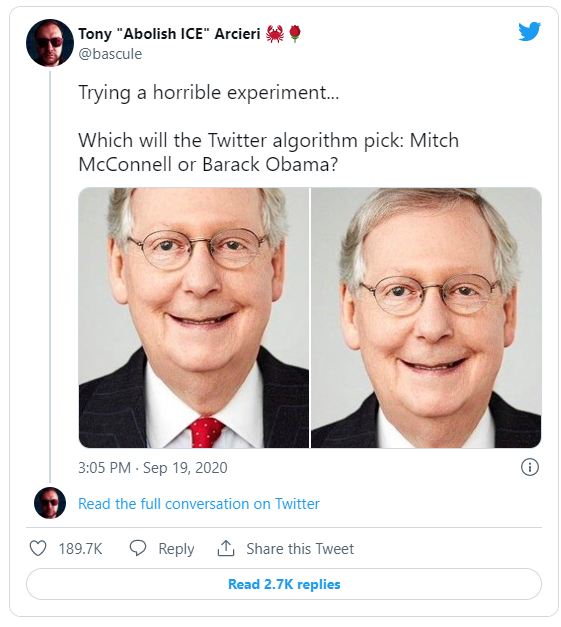
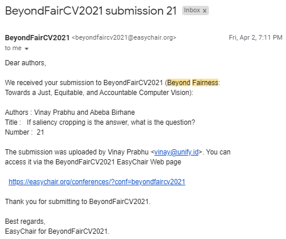
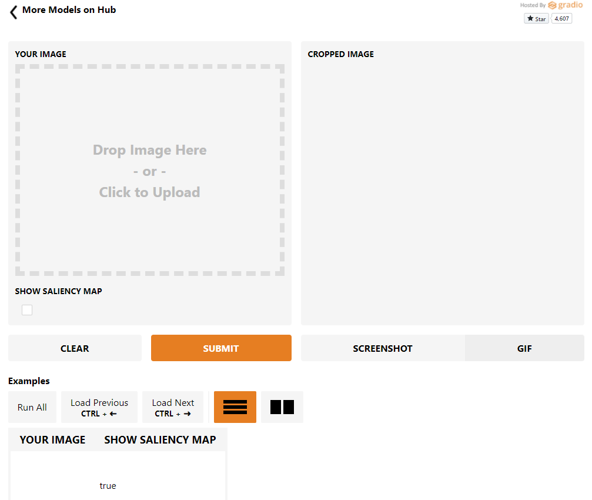
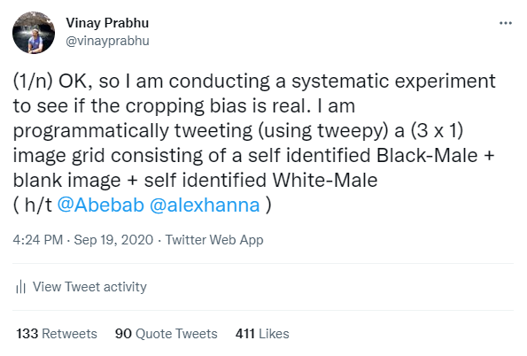
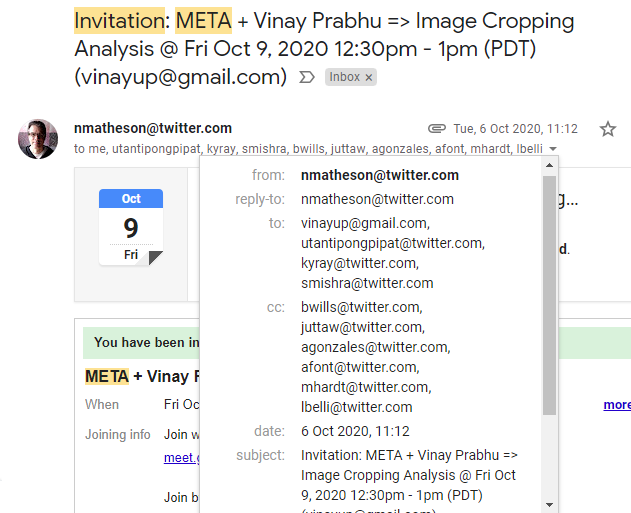
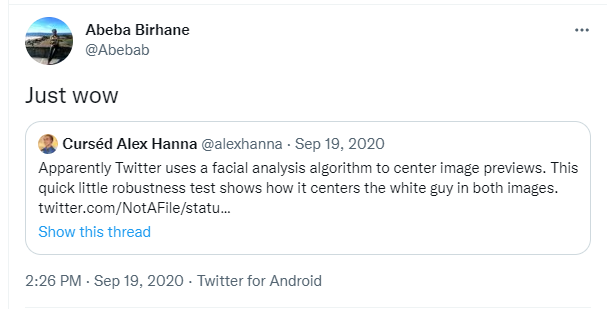

<!-- Output copied to clipboard! -->

<!-----
NEW: Check the "Suppress top comment" option to remove this info from the output.

Conversion time: 1.854 seconds.

Using this Markdown file:

1. Paste this output into your source file.
2. See the notes and action items below regarding this conversion run.
3. Check the rendered output (headings, lists, code blocks, tables) for proper
   formatting and use a linkchecker before you publish this page.

Conversion notes:

* Docs to Markdown version 1.0β31
* Tue Dec 28 2021 18:21:45 GMT-0800 (PST)
* Source doc: Twitter_SIC_Timeline
* Tables are currently converted to HTML tables.
* This document has images: check for >>>>>  gd2md-html alert:  inline image link in generated source and store images to your server. NOTE: Images in exported zip file from Google Docs may not appear in  the same order as they do in your doc. Please check the images!

----->

>>>>>  gd2md-html alert:  ERRORs: 0; WARNINGs: 0; ALERTS: 6.

<ul style="color: red; font-weight: bold"><li>See top comment block for details on ERRORs and WARNINGs. <li>In the converted Markdown or HTML, search for inline alerts that start with >>>>>  gd2md-html alert:  for specific instances that need correction.</ul>

Links to alert messages:
<a href="#gdcalert1">alert1</a>
<a href="#gdcalert2">alert2</a>
<a href="#gdcalert3">alert3</a>
<a href="#gdcalert4">alert4</a>
<a href="#gdcalert5">alert5</a>
<a href="#gdcalert6">alert6</a>

>>>>> PLEASE check and correct alert issues and delete this message and the inline alerts.

🏡<a href="https://vinayprabhu.github.io/Saliency_Image_Cropping/">Home</a>

🕐TIMELINE OF THE PROJECT🕐

**TL-DR:🦖**

 

<table>
  <tr>
   <td>Date
   </td>
   <td>Event
   </td>
  </tr>
  <tr>
   <td>September 19, 2020
   </td>
   <td>Discovery on twitter and first simple set of experiments 😦
   </td>
  </tr>
  <tr>
   <td>September 21, 2020
   </td>
   <td> ✍First <a href="https://vinayprabhu.medium.com/on-the-twitter-cropping-controversy-critique-clarifications-and-comments-7ac66154f687">blogpost</a> titled ‘On the twitter cropping controversy: Critique, clarifications & comments’ 
   </td>
  </tr>
  <tr>
   <td>October 2, 2020
   </td>
   <td>✍ Second blogpost on <em><a href="https://vinayprabhu.medium.com/scrutinizing-saliency-based-image-cropping-6b7a70cfb4f1">Scrutinizing Saliency Based Image Cropping</a></em>
   </td>
  </tr>
  <tr>
   <td>October 9, 2020
   </td>
   <td>A 30 min discussion with 2 members of a ‘meta-team’ within Twitter
   </td>
  </tr>
  <tr>
   <td>April 2, 2021
   </td>
   <td>😍 ✍ First workshop paper submission to the <a href="https://sites.google.com/view/beyond-fairness-cv/accepted-papers?authuser=0">BeyondFairCV workshop</a> (as Submission 21)
   </td>
  </tr>
  <tr>
   <td>May 23, 2021
   </td>
   <td>😎 Acceptance notification (Original decision  date was Apr 23, but got postponed on account of the pandemic) 
   </td>
  </tr>
  <tr>
   <td>June 21, 2021
   </td>
   <td>✍ Submission of the camera-ready version of the paper to the organizers of the workshop
   </td>
  </tr>
  <tr>
   <td>June 25, 2021
   </td>
   <td>🙌 Paper presentation at the <a href="https://sites.google.com/view/beyond-fairness-cv/home">workshop</a> via Discord
   </td>
  </tr>
  <tr>
   <td>Aug 11, 2021
   </td>
   <td>✍ Second paper submitted @ <a href="https://wacv2022.thecvf.com/home">WACV-2022</a> (Round-2)
   </td>
  </tr>
  <tr>
   <td> Oct 4, 2021
   </td>
   <td>Acceptance notification at WACV-2022  🙌
   </td>
  </tr>
  <tr>
   <td>January 06, 2022
   </td>
   <td>😎 🎊 Paper  + Poster presentation at WACV-2022  
   </td>
  </tr>
</table>

So, we began working on this project on September 19, 2020, when this happened!

>>>>>  gd2md-html alert: inline image link here (to images_timeline/image1.png). Store image on your image server and adjust path/filename/extension if necessary.  (<a href="#">Back to top</a>)(<a href="#gdcalert2">Next alert</a>) >>>>> 

For the next couple of hours, we began experimenting on how ridiculously biased and brittle the deployed algorithm was! 

>>>>>  gd2md-html alert: inline image link here (to images_timeline/image2.png). Store image on your image server and adjust path/filename/extension if necessary.  (<a href="#">Back to top</a>)(<a href="#gdcalert3">Next alert</a>) >>>>> 

A couple of days later (Sep 21, 2020), we published the first draft of our thoughts as a [blog post](https://vinayprabhu.medium.com/on-the-twitter-cropping-controversy-critique-clarifications-and-comments-7ac66154f687) and then on October 2, 2020, our second [blog post](https://vinayprabhu.medium.com/scrutinizing-saliency-based-image-cropping-6b7a70cfb4f1) unveiled our collaboration with the amazing folks at Gradio (Ali, Abid and Dawood) that resulted in the interactive [GradioApp](https://www.gradio.app/hub/aliabid94/saliency) where users could upload images of their choice and see how the SoTA saliency-maps looked like and how the post-cropping images looked like as well!

>>>>>  gd2md-html alert: inline image link here (to images_timeline/image3.png). Store image on your image server and adjust path/filename/extension if necessary.  (<a href="#">Back to top</a>)(<a href="#gdcalert4">Next alert</a>) >>>>> 

 Then, we were contacted by a ‘meta-team’ ethicist who presumably worked for Twitter on October 6th for a discussion on the analysis. Well, if I recall correctly, two of them did show up for the meeting during which we basically conveyed our ‘Ain’t no right way to do the wrong thing’ belief (that we still hold) and the Saliency cropping→Intellectual quicksand→ Dustbin-of-history spiel. Besides that and the pleasantries exchanged, nothing much came of it. 

>>>>>  gd2md-html alert: inline image link here (to images_timeline/image4.png). Store image on your image server and adjust path/filename/extension if necessary.  (<a href="#">Back to top</a>)(<a href="#gdcalert5">Next alert</a>) >>>>> 

Then, through Dec-Mar, we experimented with different datasets and saw how wildly the survival ratios fluctuated when we changed one seemingly insignificant dataset curation parameter (in the context of 3x1 image grids). 

In this period, we also extensively studied the literature surrounding saliency estimation and saliency cropping (helped in no small measure by the truly brilliant [Alexander Kroner](https://github.com/alexanderkroner), the lead author of the SoTA [Contextual encoder-decoder network for visual saliency prediction](https://scholar.google.com/citations?view_op=view_citation&hl=en&user=hWKtP0sAAAAJ&alert_preview_top_rm=2&citation_for_view=hWKtP0sAAAAJ:u5HHmVD_uO8C) paper) and wrote and rewrote the first draft of our paper:

 “If saliency cropping is the answer, what is the question?”[[paper](https://drive.google.com/file/d/1pt1MY29mrnNrW_pQ__FPcWFjJdbxOZmq/view?usp=sharing)] [[poster](https://drive.google.com/file/d/1dNMrd4qoobiN1hRGdzXGwXMqN9y1LMQu/view?usp=sharing)]

On April 2, 2021, we finally submitted this to the [BeyondFairCV CVPR workshop](https://sites.google.com/view/beyond-fairness-cv/accepted-papers?authuser=0).

>>>>>  gd2md-html alert: inline image link here (to images_timeline/image5.png). Store image on your image server and adjust path/filename/extension if necessary.  (<a href="#">Back to top</a>)(<a href="#gdcalert6">Next alert</a>) >>>>> 

On Sun, May 23, 10:55 AM , we were notified by the workshop organizers that our paper had been accepted! \
Here, we are sharing the (blind) reviews that we received:

_SUBMISSION: 21_

_TITLE: If saliency cropping is the answer, what is the question?_

_----------------------- REVIEW 1 ---------------------_

_SUBMISSION: 21_

_TITLE: If saliency cropping is the answer, what is the question?_

_AUTHORS: Vinay Prabhu and Abeba Birhane_

_----------- Overall evaluation -----------_

_SCORE: 2 (accept)_

_----- TEXT:_

_This is a very interesting study on an important problem online: image cropping. With Twitter getting in trouble recently because of the biases experienced using a saliency-based cropping mechanism. The authors first discuss the issues with how hazy the definition of saliency is in current CV literature and the contradictory expectations of such systems. Then they analyse the Twitter case specifically and find that perceived miscroppings were on account of either Separated saliency barycenters or saliency mismatch._

_----------------------- REVIEW 2 ---------------------_

_SUBMISSION: 21_

_TITLE: If saliency cropping is the answer, what is the question?_

_AUTHORS: Vinay Prabhu and Abeba Birhane_

_----------- Overall evaluation -----------_

_SCORE: 3 (strong accept)_

_----- TEXT:_

_Summary:_

_This paper expands on recently noticed biases with the Twitter saliency cropping algorithm, showing ethnicity/race and gender biases, in addition pointing our the presence of the male gaze in saliency algorithms. It then complicates the notion of saliency, and provides an overview of different definitions and schools of development of saliency. The paper ends by challenging the nessecity of saliency cropping in appplications like Twitter._

_Pros:_

_This paper is a thorough and contextual exmination of biases of saliency algorithms, and poses thoughful challenges to the notion of saliency itself._

_-Includes extensive examples and code_

_-Detailed, multidiscislenary background and discussion_

_-Evaluation of Twitter saliency algorithm on hundreds of cropping tests_

_Cons:_

_Other:_

_Have the authors considered which images_timeline/videos are labelled as potentially sensative content on Twitter? In my own experince I've noticed that media from or depecting Black people are disproportionately labelled as such._

On June 25, 2021, we presented the paper/poster via their discord channel and received plentiful feedback during the presentation. 

Some of the crucial feedback we received informed our next round of experimentation ( Male-gaze-like cropping investigation using the source images from Twitter and the CFD 3x1 grid images that were adherent to the original ratios of the original [viral tweet](https://www.theguardian.com/technology/2020/sep/21/twitter-apologises-for-racist-image-cropping-algorithm) )

>>>>>  gd2md-html alert: inline image link here (to images_timeline/image6.png). Store image on your image server and adjust path/filename/extension if necessary.  (<a href="#">Back to top</a>)(<a href="#gdcalert7">Next alert</a>) >>>>> 

We collected all this feedback and targeted the second round of the [WACV-2022 conference](https://wacv2022.thecvf.com/node/75) where we had published our [Large image datasets: A pyrrhic win for computer vision?](https://arxiv.org/abs/2006.16923) paper the previous year. 

On Oct 4, 2021, we received the acceptance notification at WACV-2022  🙌. Looks like the meta-reviewer bailed us out! \
[Here are the [reviews](https://github.com/vinayprabhu/Saliency_Image_Cropping/blob/main/paper/Reviews_wacv_2022.pdf) for the reader’s reference]

**Where to now?**

This is work in progress where we are still working on problems such as the fate of saliency cropping models initialized with a pre-trained vision model trained on 

    1. The recently released face-blurred version of the ImageNet dataset.
    2. The [PASS dataset](https://arxiv.org/abs/2109.13228)
    3. [Multimodal datasets](https://arxiv.org/abs/2110.01963) such as LAION-400M

        Feel free to get in touch with us if you are interested in collaborating!
